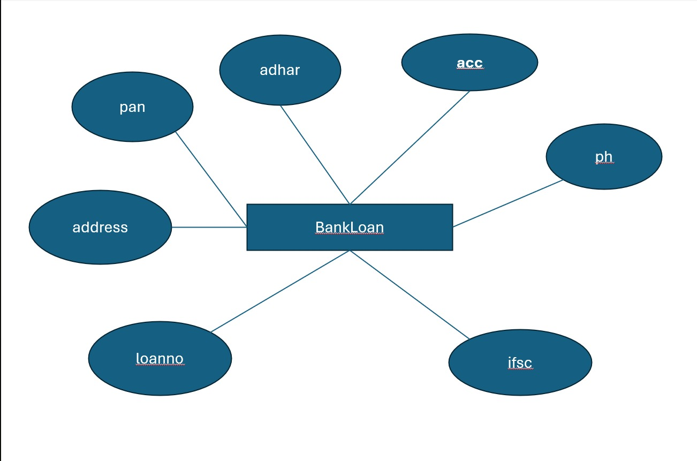

# Ex02 Django ORM Web Application
## Date: 

## AIM
To develop a Django application to store and retrieve data from a bank loan database using Object Relational Mapping(ORM).

## ENTITY RELATIONSHIP DIAGRAM



## DESIGN STEPS

### STEP 1:
Clone the problem from GitHub

### STEP 2:
Create a new app in Django project

### STEP 3:
Enter the code for admin.py and models.py

### STEP 4:
Execute Django admin and create details for 10 books

## PROGRAM
```
from django.db import models
from django.contrib import admin 
class BankLoan(models.Model):
  acc=models.IntegerField(primary_key="accno")
  ph=models.IntegerField()
  ifsc=models.CharField(max_length=100)
  loanno=models.IntegerField()
  adress=models.CharField(max_length=100)
  pan=models.IntegerField()
  adhar=models.IntegerField()

class BankLoanAdmin(admin.ModelAdmin):
 list_display=('acc','ph','ifsc','loanno','adress','pan','adhar',)

admin.py
from django.contrib import admin
from .models import BankLoan,BankLoanAdmin
admin.site.register(BankLoan,BankLoanAdmin)
```


## OUTPUT
.png>)


## RESULT
Thus the program for creating a database using ORM hass been executed successfully
